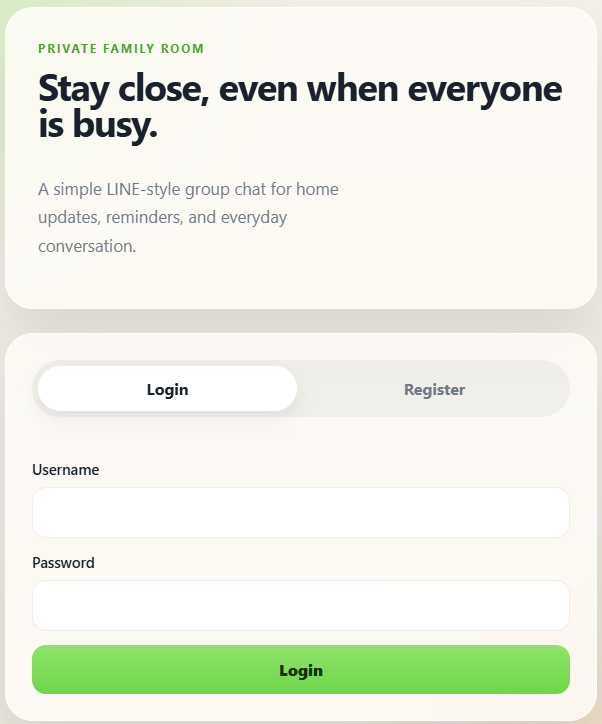

# Family Chat



A minimal LINE-like private family chat app built with Node.js, Express, Socket.IO, and MySQL.

## Features

- User registration and login with bcrypt password hashing
- Session-based authentication stored in MySQL (express-mysql-session)
- One shared family chat room
- Real-time messaging with Socket.IO (polling + WebSocket)
- Text and image messages stored in MySQL
- Image uploads — up to 6 images at once, 5 MB max, JPEG/PNG/WEBP/GIF
- Multi-image messages grouped and displayed as a grid
- Last 100 messages loaded on page entry
- Delete your own messages (text or image)
- Online users list updated in real time
- Typing indicator broadcast to other users
- Rate limiting on auth endpoints (20 requests per 15 minutes)
- Security headers via Helmet (CSP, etc.)
- Configurable sub-path deployment (e.g. `/private/fchat`)
- Mobile-friendly UI

## Files

```
server.js
public/
  login.html
  login.js
  chat.html
  chat.js
  style.css
schema.sql
.env
```

## Setup

### 1. Create the database

Run the SQL in `schema.sql`:

```bash
mysql -u root -p < schema.sql
```

Or open phpMyAdmin → Import → select `schema.sql`.

### 2. Install packages

```bash
npm install
```

### 3. Configure environment

Create a `.env` file in the project root:

```
SESSION_SECRET=<long random string>
DB_HOST=localhost
DB_PORT=3306
DB_USER=root
DB_PASSWORD=<your mysql password>
DB_NAME=family_chat
PORT=3000
NODE_ENV=development
SECURE_COOKIES=false
PUBLIC_BASE_PATH=
```

Generate a session secret:

```bash
node -e "console.log(require('crypto').randomBytes(48).toString('hex'))"
```

| Variable | Default | Description |
|---|---|---|
| `SESSION_SECRET` | — | **Required.** Session signing secret |
| `DB_HOST` | `localhost` | MySQL host |
| `DB_PORT` | `3306` | MySQL port |
| `DB_USER` | `root` | MySQL user |
| `DB_PASSWORD` | _(empty)_ | MySQL password |
| `DB_NAME` | `family_chat` | MySQL database name |
| `PORT` | `3000` | HTTP port |
| `NODE_ENV` | `development` | Set to `production` on server |
| `SECURE_COOKIES` | `false` | Set to `true` when running behind HTTPS |
| `PUBLIC_BASE_PATH` | _(empty)_ | Sub-path prefix, e.g. `/private/fchat` |

### 4. Run

```bash
node server.js
```

Open `http://localhost:3000` in a browser.

### Local HTTPS (optional)

Place `localhost+1.pem` and `localhost+1-key.pem` (generated by [mkcert](https://github.com/FiloSottile/mkcert)) in the project root. The server will automatically use HTTPS when these files are present and `NODE_ENV` is not `production`.

## Deployment

See `DEPLOY_CPANEL.md` for full cPanel deployment instructions.
